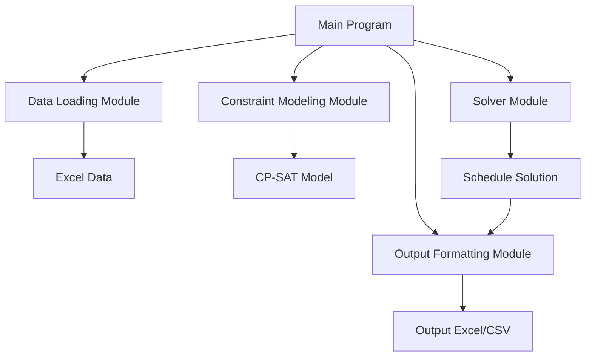

# Studio Schedule

An intelligent class scheduling system for dance studios, built in Python using Google OR-Tools.

## Features

- Reads class, teacher, and room availability from an Excel file
- Breaks each day into 15-minute time slots for flexible scheduling
- Assigns classes to rooms, teachers, and times while respecting:
  - Class duration and preferred days/time ranges
  - Teacher and room availability
  - Room group constraints (e.g. accordion walls)
  - Class-specific room and teacher preferences
- Outputs the optimized schedule to Excel or CSV

## Excel Input Format

### classes (sheet)
- class_name
- style
- level
- age_start
- age_end
- duration (in hours)
- preferred_days (comma-separated)
- preferred_time_ranges (e.g. 15:00-18:00, comma-separated)
- preferred_rooms (comma-separated)
- preferred_teachers (comma-separated)

### teachers (sheet)
- teacher_name
- availability (e.g. Monday: 15:00-20:00; Tuesday: 15:00-20:00)

### rooms (sheet)
- room_name
- availability (same format as teachers)
- group (e.g. group 1 for Room 1, Room 2, and Room 1+2)

## Project Architecture



## Project Structure

```
studio-schedule/
├── data/
│   └── schedule-data.xlsx
├── src/
│   ├── __init__.py
│   ├── main.py            # Entry point
│   ├── data_loader.py     # Functions to load and parse Excel data
│   ├── model.py           # CP-SAT model and constraints
│   ├── solver.py          # Solving logic
│   └── output.py          # Output formatting and Excel generation
├── requirements.txt
└── README.md              # Documentation
```

## Installation

```bash
python -m venv .venv
source .venv/bin/activate  # or venv\Scripts\activate on Windows
pip install -r requirements.txt
```

## Usage

```bash
python src/main.py
```

Make sure your `schedule-data.xlsx` file is in the `data/` directory.

## Requirements

See `requirements.txt` for dependencies. Main ones include:

- ortools
- pandas
- openpyxl

## License

MIT License
