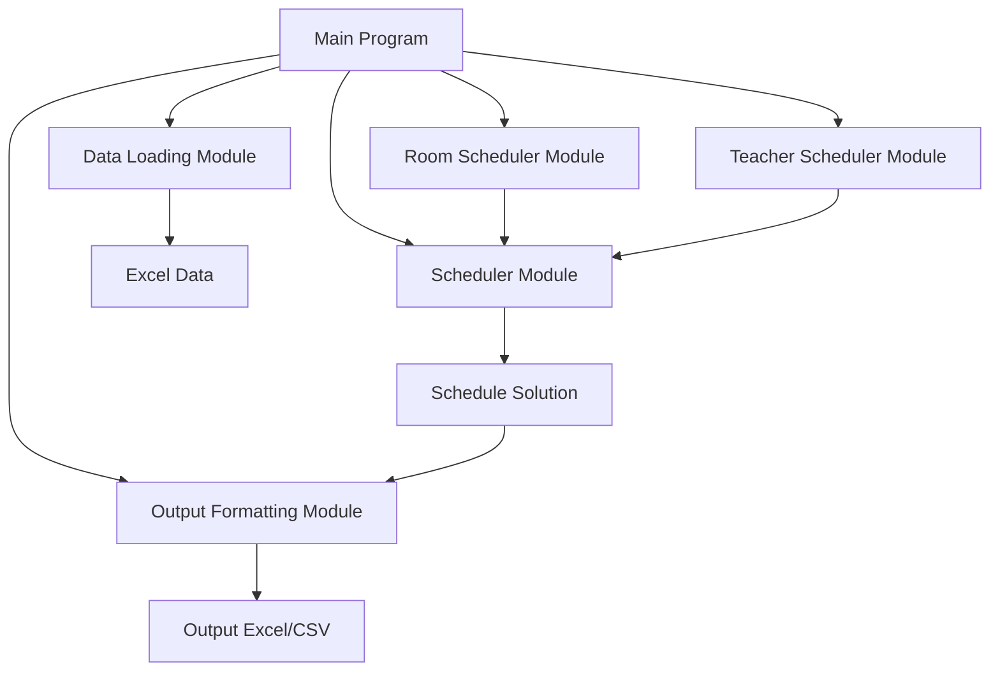

# Studio Schedule

An intelligent class scheduling system for dance studios, built in Python.

## Features

- Reads class, teacher, and room availability from an Excel file
- Breaks each day into 15-minute time slots for flexible scheduling
- Assigns classes to rooms, teachers, and times while respecting:
  - Class duration and preferred days/time ranges
  - Teacher and room availability
  - Room group constraints (e.g. accordion walls)
  - Class-specific room and teacher preferences
- Handles individual and combined rooms correctly:
  - Prevents scheduling conflicts between combined rooms and their components
  - Properly manages room preferences for both individual and combined spaces
- Implements partial scheduling to maximize class placement:
  - Schedules as many classes as possible based on constraints
  - Tracks unscheduled classes with reasons why they couldn't be placed
- Outputs comprehensive schedule information to Excel with multiple views:
  - Main schedule with all classes
  - Separate tab for unscheduled classes
  - Room-specific schedule tabs
  - Day-specific schedule tabs

## Excel Input Format

### `classes` (sheet)

Contains core information about each individual class.

- `class_id` — Unique identifier for the class instance
- `class_name` — Display name (not necessarily unique)
- `style` — Dance style (e.g., Ballet, Jazz)
- `level` — Class level (e.g., IA, IB)
- `age_start` — Minimum student age
- `age_end` — Maximum student age
- `duration` — Class duration in **hours** (e.g., 0.75 for 45 minutes)

### `teacher_availability` (sheet)

Indicates when teachers are available to teach.

- `teacher_id` — Unique ID for the teacher
- `teacher_name`
- `day`
- `start_time`
- `end_time`

### `room_availability` (sheet)

Defines room availability on a per-day basis.

- `room_id` — Unique ID for the room
- `room_name`
- `day`
- `start_time`
- `end_time`

### `room_configurations` (sheet)

Describes both individual and combined room options.

- `room_id`
- `room_name`
- `is_combined` — `TRUE` for combined rooms like Room 1+2
- `component_rooms` — Comma-separated list of subrooms (e.g., `Room 1,Room 2`)

### `class_preferences` (sheet)

Captures preferred scheduling conditions for each class.

- `class_id`
- `class_name`
- `preference_type` — One of: `day`, `time`, `room`, `teacher`
- `preference_value` — The actual preferred value (e.g., `"Monday"` or `"Makeda Hawkins"`)
- `weight` — Priority level (typically 5–10)

### `teacher_specializations` (sheet)

Maps teachers to their qualified teaching areas.

- `teacher_id`
- `teacher_name`
- `specialization_type` — One of: `style`, `age_group`
- `specialization_value` — e.g. `"Jazz"` or `"7-10"`

## Project Architecture



## Project Structure

```
studio-schedule/
├── data/
│   ├── schedule-data.xlsx
│   └── schedule-template.xlsx
├── src/
│   ├── __init__.py
│   ├── main.py            # Entry point
│   ├── data_loader.py     # Functions to load and parse Excel data
│   ├── room_scheduler.py  # Room scheduling logic
│   ├── teacher_scheduler.py # Teacher assignment logic
│   ├── scheduler.py       # Main scheduling coordination
│   └── output.py          # Output formatting and Excel generation
├── debug_room_prefs.py    # Utility for debugging room preferences
├── fix_data.py            # Utility for fixing data issues
├── check_overlaps.py      # Utility for checking schedule conflicts
├── requirements.txt
└── README.md              # Documentation
```

## Output Format

The scheduler generates an Excel file with multiple tabs for different views of the schedule:

1. **Schedule**: The main tab containing all scheduled classes with details including:

   - Class Name, Style, Level, Age Range
   - Room and Teacher assignments
   - Day, Start Time, End Time, and Duration

2. **Unscheduled Classes**: A separate tab listing classes that couldn't be scheduled, including:

   - Class details (Name, Style, Level, Age Range, Duration)
   - Reason why the class couldn't be scheduled (e.g., "No compatible room-time slot found")

3. **Room-specific tabs**: Individual tabs for each room showing only the classes scheduled in that room.

4. **Day-specific tabs**: Individual tabs for each day of the week showing the classes scheduled on that day.

This comprehensive output format makes it easy to analyze the schedule from different perspectives and identify any issues or opportunities for improvement.

## Using the Schedule Template

A pre-formatted Excel file is available at `./data/schedule-template.xlsx` to help you get started.

### Instructions

1. Open `schedule-template.xlsx` in Excel or Google Sheets.
2. Fill out each sheet:
   - **classes**: Add your studio’s classes, styles, age ranges, durations, and preferences.
   - **teachers**: List each teacher and their availability by day and time range.
   - **rooms**: Enter your studio rooms, their availability, and group identifiers (used for combined spaces like Room 1+2).
3. Sample rows are included in each sheet for reference. **Please delete these before running the program**, but **do not change the column headers or sheet names**.
4. Save the file (keeping the same structure and sheet names).
5. Place the file in the `./data/` folder before running the program.

### Formatting Rules

- **Days and time values** should be entered in the format:
  - `Monday:15:15-18:00,Tuesday:16:00-20:00`
- Use **commas with no spaces** between entries.
- Ensure all time values use **24-hour format** (`HH:MM`).

**Important:** Do not rename the sheets or change the column names — the program relies on exact matches.

## Installation

### Optional: Install VS Code

We recommend using [Visual Studio Code](https://code.visualstudio.com/) as your editor for this project.

1. Download and install VS Code: https://code.visualstudio.com/
2. Open the project folder (`studio-schedule/`) in VS Code
3. If prompted, install the recommended extensions (such as Python support)
4. Open a terminal in VS Code (`View` > `Terminal`) and run the setup commands:

```bash
python -m venv .venv
source .venv/bin/activate  # or .venv\Scripts\activate on Windows
pip install -r requirements.txt
```

## Usage

```bash
python src/main.py [--data DATA_FILE] [--output OUTPUT_DIR]
```

### Command-line Arguments

- `--data` or `-d`: Path to the Excel file containing schedule data (default: `data/schedule-data.xlsx`)
- `--output` or `-o`: Directory to save output files (default: `output`)

### Example Usage

```bash
# Use default data file and output directory
python src/main.py

# Specify a different data file
python src/main.py --data data/my-schedule-data.xlsx

# Specify both data file and output directory
python src/main.py --data data/my-schedule-data.xlsx --output my-output
```

The program will generate an Excel file with the optimized schedule in the specified output directory. The file will be named with a timestamp (e.g., `schedule_20250517_174510.xlsx`).

### Statistics

After scheduling is complete, the program will display statistics including:

- Total number of classes
- Number of scheduled classes
- Number of unscheduled classes
- Scheduling rate (percentage of classes scheduled)
- Number of classes unscheduled due to room conflicts
- Number of classes unscheduled due to teacher conflicts

## Requirements

See `requirements.txt` for dependencies. Main ones include:

- pandas (>= 1.4.0): For data manipulation and analysis
- openpyxl (>= 3.0.0): For Excel file reading and writing

## License

GNU General Public License
